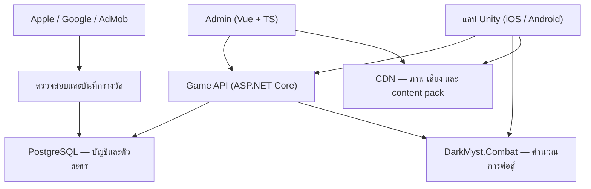

# โครงสร้างระบบ

## ภาพรวม



`DarkMyst.Combat` ปรากฏสองที่โดยตั้งใจ — เป็น **assembly เดียวกัน** ที่คอมไพล์ครั้งเดียว
แล้วรันทั้งบนเซิร์ฟเวอร์และในไคลเอนต์

## ความรับผิดชอบของแต่ละส่วน

| ส่วน | เทคโนโลยี | หน้าที่ |
| --- | --- | --- |
| ตัวเกม | Unity 2022.3 LTS + C# | หน้าจอ การควบคุม ภาพ เสียง แอนิเมชัน |
| กฎการต่อสู้ | `DarkMyst.Combat` (netstandard2.1, ไม่มี dependency) | คำนวณผลและสร้างลำดับเหตุการณ์ |
| ข้อมูลและการปั้น | `DarkMyst.Content` (netstandard2.1 + Newtonsoft) | โหลด content pack, สูตรเลเวล/evolve |
| ระบบหลังบ้าน | ASP.NET Core | บัญชี การสำรวจ evolve รางวัล ร้านค้า |
| ฐานข้อมูล | PostgreSQL | ข้อมูลถาวรและธุรกรรม |
| ไฟล์เนื้อหา | Object storage + CDN | ภาพ เสียง และ content pack แต่ละเวอร์ชัน |
| หน้าจัดการ | Vue + TypeScript | เพิ่มตัวละคร ด่าน ร้านค้า และตรวจข้อมูล |
| ปฏิบัติการ | Managed hosting + logging + backups | ดูแลระบบโดยลดภาระเซิร์ฟเวอร์ |

เริ่มจาก backend **ชุดเดียวที่แบ่งโมดูลภายใน** ยังไม่ต้องแยก microservices หรือใช้ Kubernetes
จนกว่าจะมีตัวเลขผู้เล่นจริงที่บอกว่าจำเป็น

## โครงสร้างรีโป

```
DarkMyst.sln
src/DarkMyst.Combat/      กฎการต่อสู้ — ไม่มี dependency, ไม่รู้จัก Unity
src/DarkMyst.Content/     content pack, สูตรเลเวลและ evolve
tests/                    เทสต์ของกฎทั้งหมด (75 เคส)
tools/DarkMyst.SimRunner/ CLI: validate / battle / sweep
tools/build-unity-plugins.sh
content/                  ข้อมูลเกมทั้งหมดเป็น JSON — แหล่งความจริงชุดเดียว
unity/DarkMyst/           โปรเจกต์ Unity
docs/                     เอกสารชุดนี้
```

ยังไม่มี `server/` และ `admin/` ในรีโปนี้ — จะเพิ่มในระยะ D ตาม [06-roadmap.md](06-roadmap.md)
โดยอ้างอิง `src/DarkMyst.Combat` และ `src/DarkMyst.Content` ชุดเดิม

## ทำไม Unity ถึงใช้ DLL ไม่ใช่ source

`tools/build-unity-plugins.sh` คอมไพล์สองไลบรารีแล้ววางไฟล์ `.dll` ลง
`unity/DarkMyst/Assets/Plugins/DarkMyst/` วิธีนี้ทำให้พิสูจน์ได้ว่าไคลเอนต์และเซิร์ฟเวอร์
รัน **ไบนารีเดียวกันจริง ๆ** ไม่ใช่ซอร์สสองชุดที่ "น่าจะเหมือนกัน"

`netstandard2.1` เป็นเป้าหมายที่ทั้ง ASP.NET Core และ Unity 2021.2+ (ทั้ง Mono และ IL2CPP)
โหลดได้ ไฟล์ที่ไม่คัดลอกคือ `Newtonsoft.Json.dll` เพราะ Unity มีให้อยู่แล้วผ่าน
`com.unity.nuget.newtonsoft-json` — สำเนาที่สองจะทำให้ build พัง

## การ build สองแพลตฟอร์ม

ใช้โค้ดร่วมกันได้มาก แต่ยังต้อง build, ตั้งค่า store และทดสอบแต่ละระบบแยกกัน
ฝั่ง iOS ใช้ Unity สร้างโปรเจกต์ Xcode แล้ว build ต่อบน macOS

**ต้องสร้าง build ทั้งสองระบบตั้งแต่ระยะ B อย่างสม่ำเสมอ** ไม่รอพอร์ตตอนเกมเสร็จ
และควรมี iPhone กับ Android ระดับกลางไว้ทดสอบจริงตั้งแต่ระยะเดียวกัน

## กฎที่ห้ามแหก

1. `DarkMyst.Combat` **ห้ามอ้างอิง Unity, ห้ามอ้างอิง NuGet ใด ๆ** และห้ามใช้เลขทศนิยม
2. `DarkMyst.Combat` **ห้ามใช้ `System.Random`** — ใช้ `DeterministicRandom` เท่านั้น
3. ผลการต่อสู้ที่จ่ายรางวัลจริงต้องมาจากเซิร์ฟเวอร์เสมอ ไคลเอนต์แค่เล่นซ้ำ log
4. ทุกครั้งที่แก้ `CombatRules` ต้องขึ้น `CombatRules.Version`
5. ทุกครั้งที่แก้ `content/` ต้องขึ้น `contentVersion` ใน `manifest.json`
